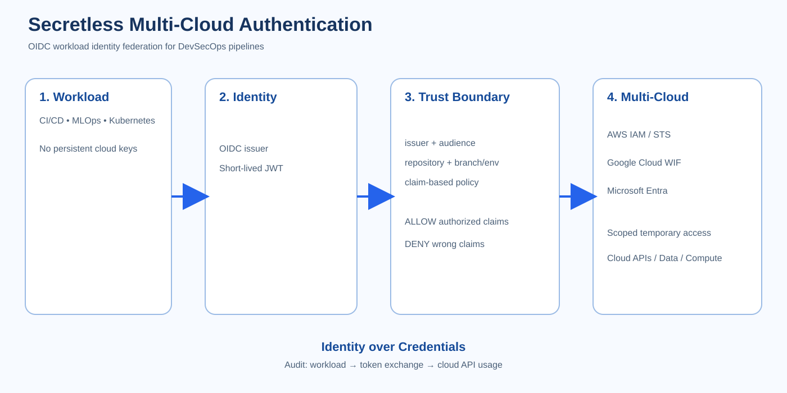

# Secretless Multi-Cloud Authentication with Workload Identity

Reference implementation and reproducible evidence package for the Conf42 DevSecOps 2026 talk:

> **Secretless Multi-Cloud Authentication with Workload Identity for DevSecOps Pipelines**

## Goal

Demonstrate a DevSecOps authentication pattern where workloads use OIDC assertions and cloud workload-identity federation instead of long-lived cloud credentials.

The repository separates claims, simulations, and real measurements so experimental numbers are not presented as facts until reproduced.

## Architecture

The architecture flow is:

**Workload → OIDC assertion → claim validation → federation → short-lived scoped access → cloud APIs → audit/provenance**

The editable diagram source is docs/architecture.mmd.

## What is implemented

- GitHub Actions OIDC workload identity
- AWS IAM / STS federation example
- Exact issuer, audience, repository, and branch claim conditions
- 15-minute maximum AWS role session
- Least-privilege S3 read demonstration
- Failure-closed static-key detection
- Deterministic credential-validity-window model
- Threat model and evidence plan

## Evidence roadmap

| Claim | Evidence | Status |
|---|---|---|
| No long-lived AWS key required | GitHub OIDC workflow + environment check | To execute |
| Claim-scoped trust | Authorized/unauthorized branch tests | To execute |
| Bounded credential lifetime | STS session configuration + CloudTrail | To execute |
| Exposure-window reduction | Deterministic TTL model | Reproducible |
| Token-exchange latency | Real CI p50/p95/p99 measurements | To measure |
| Failure-closed | Federation denial + no static fallback | To execute |

## Credential validity-window metric

For a 365-day static credential versus a 15-minute federated credential:

1 - 15 / (365 × 24 × 60) ≈ 99.997%

For a 10-minute credential:

1 - 10 / (365 × 24 × 60) ≈ 99.998%

This is not a breach-probability or overall attack-surface reduction. It is specifically the reduction in credential validity window under the stated assumptions.

## Run the model

    python3 simulation/exposure_model.py

Expected output:

    15 minute token: 99.997146% shorter validity window
    10 minute token: 99.998097% shorter validity window

## AWS setup

The AWS proof creates a dedicated private S3 bucket and an IAM role in the target AWS account. No AWS access key is stored in GitHub or in this repository.

The GitHub Actions proof uses the \`demo\` environment. The AWS trust policy therefore authorizes the exact environment-based OIDC subject:

\`repo:vvelavarthipati/secretless-multi-cloud:environment:demo\`

Before running the workflow, configure these **GitHub Environment variables** under \`demo\`:

- \`AWS_ROLE_ARN\` — Terraform \`role_arn\` output
- \`AWS_REGION\` — for example \`us-east-1\`
- \`DEMO_BUCKET\` — Terraform \`demo_bucket_name\` output

The AWS account ID is an identifier only; it is not an authentication secret.

Copy infra/aws/terraform.tfvars.example to infra/aws/terraform.tfvars, populate the repository/owner IDs and an existing S3 bucket ARN, then run Terraform.

Configure the repository/environment variables required by pipelines/github-actions/aws-oidc-demo.yml before running the workflow.

## Negative tests

- authorized branch → allowed
- unauthorized branch → denied
- wrong audience → denied
- wrong repository → denied
- wrong environment → denied
- expired assertion → denied
- OIDC unavailable → fail closed
- static credential fallback → not configured

## Limitations

Short-lived credentials reduce the validity window of a stolen credential. They do not prevent compromise of an authorized workload or abuse while valid.

Latency, CloudTrail correlation, failure behavior, concurrency, and production security effects require environment-specific measurements.

## Sources

- GitHub Actions OIDC for AWS: https://docs.github.com/en/actions/how-tos/secure-your-work/security-harden-deployments/oidc-in-aws
- AWS OIDC federation: https://docs.aws.amazon.com/IAM/latest/UserGuide/id_roles_create_for-idp_oidc.html
- AWS STS AssumeRoleWithWebIdentity: https://docs.aws.amazon.com/STS/latest/APIReference/API_AssumeRoleWithWebIdentity.html
- Google Cloud Workload Identity Federation: https://cloud.google.com/iam/docs/workload-identity-federation
- Azure GitHub Actions OIDC: https://learn.microsoft.com/en-us/azure/developer/github/connect-from-azure-openid-connect
- configure-aws-credentials: https://github.com/aws-actions/configure-aws-credentials