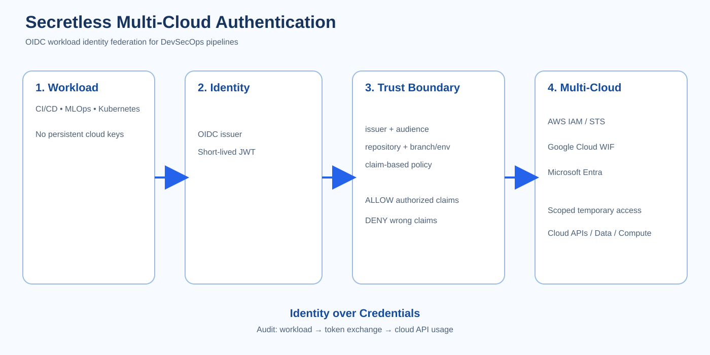

# Secretless Multi-Cloud Authentication with Workload Identity

Reference implementation and reproducible evidence package for the Conf42 DevSecOps 2026 talk:

> **Secretless Multi-Cloud Authentication with Workload Identity for DevSecOps Pipelines**

## What this repository demonstrates

This project demonstrates a DevSecOps authentication pattern in which a CI/CD workload uses an OIDC identity assertion and cloud workload-identity federation instead of a long-lived cloud access key.

The reference implementation currently provides an AWS proof:

**GitHub Actions → OIDC → AWS IAM/STS → short-lived role session → private S3**

The repository is intentionally **clone-and-replace friendly**. A different user can clone it, replace the environment-specific values, and deploy the same pattern into their own AWS account without modifying the security model.

## Architecture



The generalized architecture is:

**Workload → OIDC assertion → claim validation → federation → short-lived scoped access → cloud APIs → audit/provenance**

Editable diagram source:

`docs/architecture.mmd`

### Current implementation scope

Implemented and validated in the AWS reference:

- GitHub Actions OIDC workload identity
- AWS IAM / STS federation
- GitHub OIDC issuer restriction
- STS audience restriction
- Repository + GitHub environment subject restriction
- 15-minute maximum AWS role session
- Least-privilege S3 read access
- Static AWS credential fallback detection
- Deterministic credential-validity-window model
- Reproducible validation workflow

GCP Workload Identity Federation and Microsoft Entra workload federation are represented as target patterns in the multi-cloud architecture. They are **not claimed as completed end-to-end implementations or measurements in this repository**.

---

## Clone and run with your own environment

The public repository does **not** contain:

- AWS access keys or secret keys
- GitHub tokens
- AWS account-specific role ARNs
- AWS account IDs
- Account-specific bucket names
- User-specific GitHub environment values

The repository contains placeholders and configuration examples only.

### Prerequisites

You need:

- An AWS account where you can create IAM and S3 resources
- Terraform `>= 1.9.0`
- A GitHub repository containing this project
- Permission to configure GitHub Actions environments and variables

### 1. Clone

Replace the URL below with your own repository URL if you fork or copy this project.

```bash
git clone <YOUR_REPOSITORY_URL>
cd secretless-multi-cloud
```

### 2. Configure Terraform

Go to the AWS infrastructure directory:

```bash
cd infra/aws
cp terraform.tfvars.example terraform.tfvars
```

Edit `terraform.tfvars`:

```hcl
aws_region         = "<AWS_REGION>"
github_repository  = "<GITHUB_OWNER>/<GITHUB_REPOSITORY>"
github_environment = "demo"
role_name          = "secretless-multicloud-github"
```

Replace:

- `<AWS_REGION>` with the AWS region you want to use.
- `<GITHUB_OWNER>/<GITHUB_REPOSITORY>` with the repository that will run the GitHub Actions workflow.

You may change `github_environment` or `role_name` if required.

**Do not commit `terraform.tfvars`.**

The repository's `.gitignore` excludes `*.tfvars` while keeping `terraform.tfvars.example` tracked.

### 3. Validate and deploy

Run:

```bash
terraform init
terraform fmt -check
terraform validate
terraform plan
```

Review the plan carefully, then:

```bash
terraform apply
```

Terraform creates the AWS-side resources required for the reference proof:

- GitHub Actions OIDC provider
- IAM role with repository + environment-scoped trust
- 15-minute maximum role session
- Private S3 bucket
- S3 public-access blocking
- Server-side encryption
- S3 versioning
- Least-privilege S3 read permissions

### 4. Capture Terraform outputs

After `terraform apply`:

```bash
terraform output role_arn
terraform output demo_bucket_name
```

The role ARN and bucket name are generated for **your AWS account**.

### 5. Configure the GitHub environment

Create a GitHub Actions environment using the same name configured in Terraform. The default is:

`demo`

Under that environment, create these variables:

| Variable | Value |
|---|---|
| `AWS_ROLE_ARN` | Terraform `role_arn` output |
| `AWS_REGION` | Your configured AWS region |
| `DEMO_BUCKET` | Terraform `demo_bucket_name` output |

These values belong in GitHub repository/environment configuration, **not in source code**.

The role ARN and bucket name are environment-specific identifiers. They are not long-lived credentials, but keeping them out of the public source repository makes the example portable and avoids coupling the reference implementation to one AWS account.

### 6. Run the AWS proof

The workflow is:

`.github/workflows/aws-oidc-demo.yml`

It is intentionally **manual-dispatch only** so a cloned repository does not accidentally attempt AWS federation before the user has configured their environment.

The workflow:

1. Requests an OIDC identity token.
2. Exchanges the assertion for a short-lived AWS role session.
3. Uses a maximum 900-second session.
4. Verifies the federated identity with `aws sts get-caller-identity`.
5. Fails if a static AWS access key is present.
6. Reads the dedicated private S3 bucket using the federated session.

No AWS access key needs to be created for the GitHub Actions workflow.

---

## Repository validation

The separate validation workflow:

`.github/workflows/validate.yml`

runs on pushes, pull requests, and manual dispatch.

It validates:

- Terraform formatting
- Trust-policy JSON
- GitHub OIDC issuer
- STS audience restriction
- Repository + environment subject restriction
- 15-minute session configuration
- Static AWS key guard
- STS identity proof
- S3 access proof
- Deterministic credential-validity-window model

Run the deterministic checks locally:

```bash
python3 scripts/validate_reference.py
python3 simulation/exposure_model.py
```

Expected model output:

```text
15 minute token: 99.997146% shorter validity window
10 minute token: 99.998097% shorter validity window
```

---

## Results and evidence

The project intentionally separates **reference validation** from **live AWS measurements**.

### Reproducible reference validation

The repository validates that the implementation contains:

- OIDC federation
- Correct issuer
- STS audience restriction
- Repository + environment subject restriction
- 900-second maximum session
- Least-privilege S3 actions
- Static-key fallback detection

See:

`results/reference-results.md`

### Environment-dependent measurements

The following require an actual AWS/GitHub environment and should only be described as measured after execution:

- End-to-end AWS federation success
- OIDC/STS exchange latency
- CloudTrail session evidence
- Negative federation tests
- Failure-closed behavior
- Production workload/concurrency measurements

This distinction is deliberate: **the repository does not present simulated or unexecuted AWS measurements as experimental facts.**

---

## Credential validity-window model

The deterministic model compares a hypothetical 365-day static credential with short-lived federated credentials.

For a 15-minute credential:

`1 - 15 / (365 × 24 × 60) ≈ 99.997%`

For a 10-minute credential:

`1 - 10 / (365 × 24 × 60) ≈ 99.998%`

These numbers represent the reduction in **credential validity window under the stated assumptions**.

They are **not** breach probabilities, compromise probabilities, or a measurement of total attack-surface reduction.

---

## Security model

The AWS trust policy restricts federation using:

- GitHub Actions OIDC issuer
- `sts.amazonaws.com` audience
- Exact repository subject
- Exact GitHub environment subject

The resulting AWS role is limited to:

- 900-second maximum sessions
- `s3:GetObject`
- `s3:ListBucket`
- The dedicated Terraform-created S3 bucket

The workflow also explicitly rejects the presence of a static `AWS_ACCESS_KEY_ID`.

### Important limitation

Short-lived credentials reduce the time window in which a valid credential can be abused. They do **not** eliminate compromise of an authorized workload or prevent misuse while the federated session remains valid.

---

## Negative-test plan

The reference design should be tested against:

- Authorized environment → allowed
- Unauthorized environment → denied
- Wrong audience → denied
- Wrong repository → denied
- Expired assertion → denied
- OIDC unavailable → fail closed
- Static credential fallback → not configured

The current Terraform implementation is **environment-scoped**, not branch-scoped. Therefore the project does not claim branch-specific authorization.

---

## Multi-cloud direction

The AWS implementation is the concrete proof-of-pattern.

The broader design maps the same workload-identity principle to:

| Cloud | Federation pattern | Repository status |
|---|---|---|
| AWS | GitHub OIDC → IAM/STS | Reference implementation |
| Google Cloud | Workload Identity Federation | Target architecture |
| Microsoft Azure | GitHub OIDC → Entra workload federation | Target architecture |

Additional cloud implementations should be added only when their configuration and measurements can be reproduced and documented.

---

## Project structure

```text
secretless-multi-cloud/
├── .github/
│   └── workflows/
│       ├── validate.yml
│       └── aws-oidc-demo.yml
├── infra/
│   └── aws/
│       ├── main.tf
│       ├── variables.tf
│       ├── outputs.tf
│       ├── terraform.tfvars.example
│       └── trust-policy.template.json
├── scripts/
│   └── validate_reference.py
├── simulation/
│   └── exposure_model.py
├── docs/
│   ├── architecture.mmd
│   ├── architecture.svg
│   └── evidence-plan.md
├── results/
│   └── reference-results.md
└── README.md
```

---

## Sources

- GitHub Actions OIDC for AWS: https://docs.github.com/en/actions/how-tos/secure-your-work/security-harden-deployments/oidc-in-aws
- AWS OIDC federation: https://docs.aws.amazon.com/IAM/latest/UserGuide/id_roles_create_for-idp_oidc.html
- AWS STS AssumeRoleWithWebIdentity: https://docs.aws.amazon.com/STS/latest/APIReference/API_AssumeRoleWithWebIdentity.html
- Google Cloud Workload Identity Federation: https://cloud.google.com/iam/docs/workload-identity-federation
- Azure GitHub Actions OIDC: https://learn.microsoft.com/en-us/azure/developer/github/connect-from-azure-openid-connect
- configure-aws-credentials: https://github.com/aws-actions/configure-aws-credentials

## License

This repository is intended as a reference implementation and evidence package for the Secretless Multi-Cloud project.
